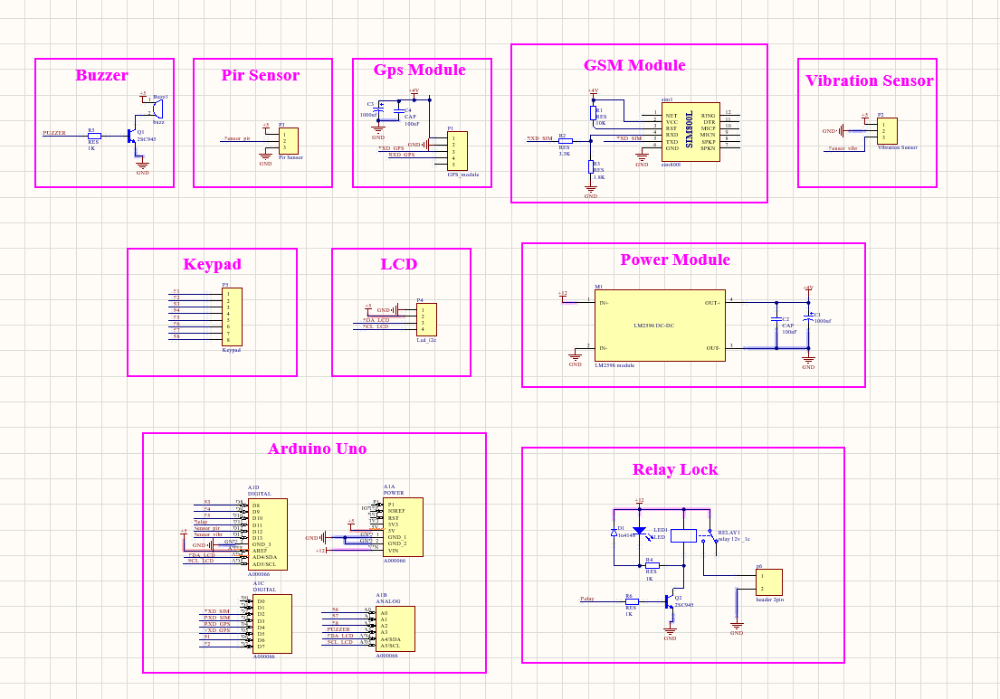
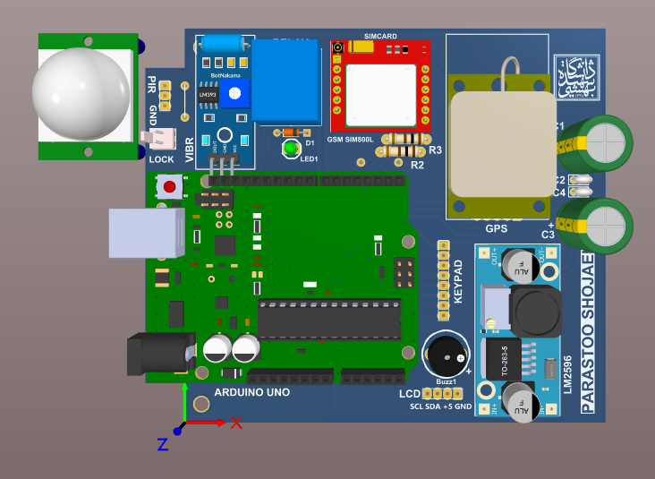
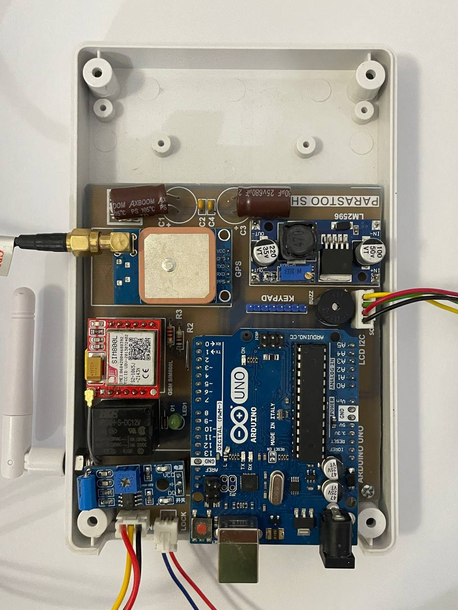
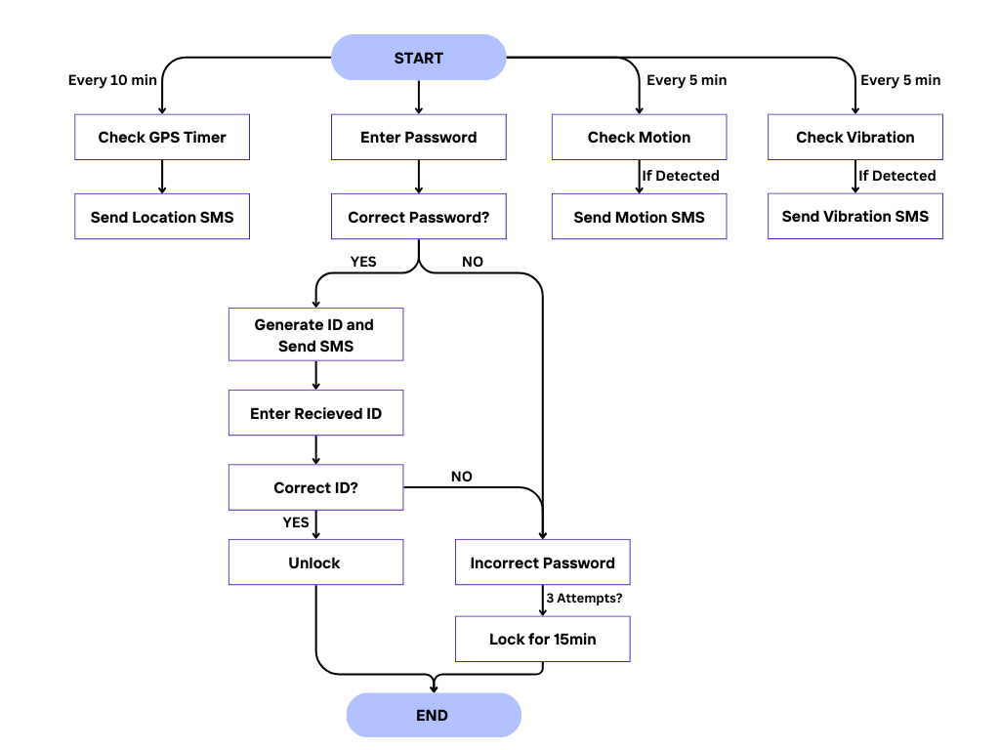

# Smart Safe Based on IoT

An IoT-enabled smart safe developed as my **BSc Electrical Engineering thesis** at Shahid Beheshti University. The system protects valuables through real-time monitoring, multi-layer authentication, and SMS alerts, built around an Arduino Uno with integrated sensors and GSM/GPS communication.

---

## Project Overview

The Smart Safe combines embedded programming, sensor integration, and SMS communication into a single security solution. Users can lock and unlock the safe through a two-step authentication process, receive alerts when tampering is detected, and track the safe's location remotely in case of theft.

## Key Features

- **Multi-layer authentication** — a password entered on the keypad, followed by a one-time ID sent to the user's phone via SMS, which must be entered to unlock the safe.
- **Vibration detection** — an SW-420 sensor detects physical tampering and triggers an SMS alert.
- **Motion detection** — a PIR sensor detects movement around the safe and sends an alert.
- **GPS location tracking** — a NEO-M8 module sends the safe's coordinates to the user every 10 minutes.
- **Remote control via SMS** — users can enable or disable sensors with commands such as `Motion_on` or `Vibr_on`.
- **Brute-force protection** — after three incorrect attempts, the safe locks for 15 minutes.
- **Persistent storage** — the password and phone number are stored in EEPROM so they survive power loss.

## Hardware Components

- **Arduino Uno** — main controller
- **SW-420** vibration sensor
- **PIR** motion sensor
- **NEO-M8** GPS module
- **SIM800L** GSM module (SMS)
- **16×2 LCD** display + **keypad** for the user interface
- **Relay lock**, buzzer, and a custom LM2596-based power module

## How It Works

The system runs several routines in parallel using timers:

- It checks for vibration and motion every few minutes and sends an SMS if either is triggered.
- It sends a GPS location update every 10 minutes.
- To unlock, the user enters a password, then an ID sent to their phone by SMS. Three failed attempts lock the safe for 15 minutes.

## Circuit & Build

### Schematic

### PCB (3D View)

### Assembled Board

### System Flowchart

## Tech & Skills

Arduino · C++ · Embedded Systems · IoT · Sensor Integration · GSM/GPS · PCB Design · EEPROM
